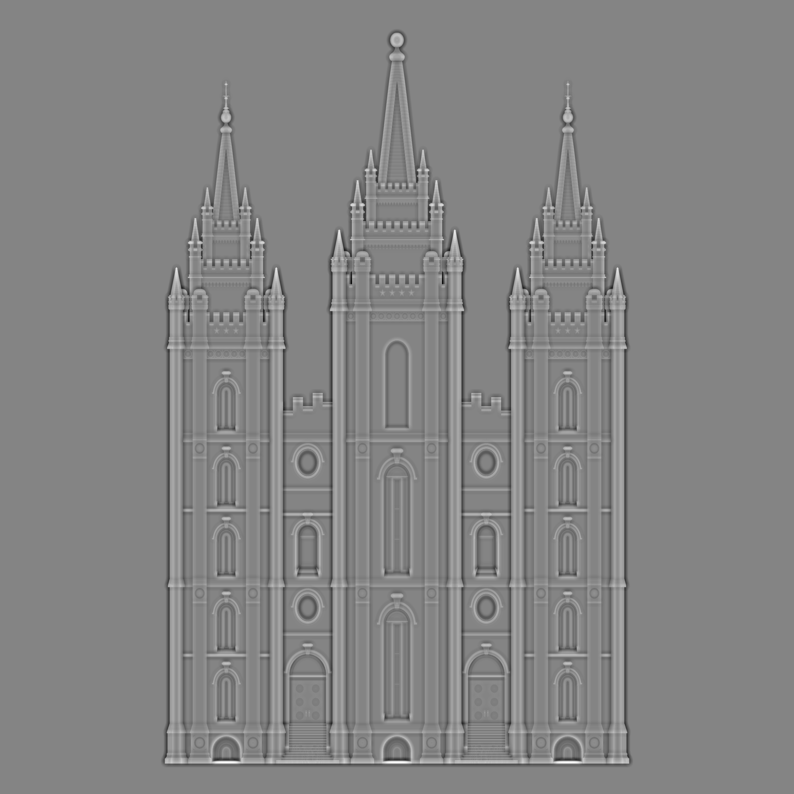

# digital-bas-relief
Code for converting a depth map to a bas relief image

This is a simple implementation of the paper  by Weyrich et al (SIGGRAPH 2007).

This code translates a depth image into a bas relief image, as shown in these images:




In the original paper, the authors frame the problem of converting a depth map to a bas-relief image as an optimization problem, where gradients are first compressed, then treated as constraints, and a new bas-relief image is constructed by attempting to satisfy as many constraints as possible.  They use a Poisson equation as the final optimization objective; we simplify that to a simple linear-least-squares objective that is (I think) mathematically equivalent but allows us to take advantage of sparse linear solvers. This, in turn, allows us to scale easily to high-resolution images.

## Running the code

To recreate the images above, run:
```
python ./main.py -i slc_depth.png -i slc_bas_relief.png                                                                            
```
The code expects the depth map to be input as a single-channel, 8-bit grayscale image.  Large values (white) mean "far away", and small values (black) mean "close".

There are only a few parameters to be aware of.  The primary parameter is `--gc_alpha`, which controls the gradient compression constant. You'll probably have to play with it.  If for whatever reason the solve fails, you may need to play with the tolerance parameters in the least-squares solver; these are not exposed on the command line.
